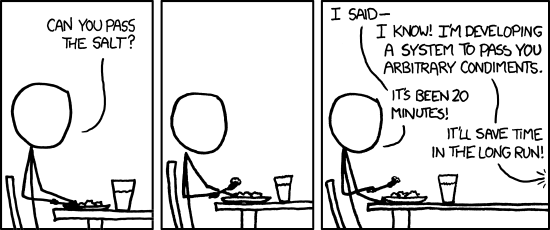

# philset

A skills library for [Claude Code](https://docs.anthropic.com/en/docs/claude-code)
that replaces approve-and-execute planning with iterative, document-driven
development.

## Measure twice. Cut once. Refactor never.

Claude Code is powerful out of the box, but its default planning workflow
— write a plan, approve it, execute it — assumes one round of alignment
is enough. For complex work, it isn't. Misaligned assumptions compound
silently until you're reviewing code that solves the wrong problem.

`philset` fixes this by replacing the single-pass planning phase with an
iterative, collaborative design loop that leverages both human and agentic
intelligence. The result is clean, AI-written code which works the first
time and generates its own documentation — not a rough draft full of tech
debt and gotchas.

## Practice makes permanent.

`philset` assumes a software engineering workflow based on two orthogonal
cadences: the **developer workday**, and the **feature branch lifecycle**.

### Workday Cadence
| Skill | Purpose |
|-------|---------|
| `/hello` | Loads context, reads state files, gives a status summary |
| `/ttyl` | Persists decisions and progress so the next session picks up cleanly |

The developer workday begins when you sit down at your desk, launch Claude
Code, and type `/hello` into the terminal. At this point, the philset takes
over.

`/hello` walks the [context tree](#deep-roots-are-not-reached-by-the-git-commit) of your developer
workspace, gathering data from project-level, domain-level, and user-level
meta-context directories. Then, it scans the current state of your
workspace and orients the agent to ongoing work. By the time Claude says
"Good morning," he's already caught up.

The other `philset` skills are designed to track work and persist decisions
across sessions, so that nothing ever gets lost. Starting your day with `/hello`
sets you up for success. Ending it with `/ttyl` locks in your gains, so you
can build on them tomorrow.

## An hour of planning saves a day of debugging.

While `/hello` and `/ttyl` read and write state across sessions, the feature
development skills read and write state across the lifecycle of a git branch.

### Lifecycle Cadence
| Skill | Purpose |
|-------|---------|
| `/assess` | Structured assessment of a feature, system, or area |
| `/draft` | Create a working design document for collaborative iteration |
| `/ship` | Accept the design and begin implementation |
| `/review` | Pre-merge code review with design reconciliation |

These skills are designed to be used in sequence, and each builds on
documentation produced or modified by the last skill in the cycle. This
is where the real work gets done.

### `/assess`: What's in scope for this feature?

The feature lifecycle begins when you ask the agent to `/assess` the task
at hand. The agent explores the codebase — reading source files, git
history, design docs, decision logs, and anything in the inbox — then
produces a structured assessment: what exists, what's working, what's
broken, and what to do next.

The assessment is a durable artifact. It grounds the design conversation
in reality, not assumptions. When you move on to `/draft`, both you and
the agent are working from the same understanding of the current state.

### `/draft`: How should we solve this problem?

`/draft` creates a design document and presents it for iteration. This is
where the `philset` diverges from the standard Claude Code workflow.

While Claude Code's built-in `/plan` skill accepts a minimal amount of
iteration, `/draft` is designed to enforce alignment of intent through
maximal iteration. The design document produced by this skill is a *proposal,*
and as the engineer in charge, you are expected to have notes.




[*Relevant XKCD*](https://xkcd.com/974/)

While `/draft`ing the initial design, Claude will sketch the desired state
of the codebase at merge time: what's been added, what's been removed, what's
been relocated or adjusted. The draft will include all relevant reasoning
steps, from design principles right down to code snippets, and present them
in a simple, readable format for your review.

As you read the first draft, you can make notes inline, adjust Claude's
reasoning, correct his assumptions, and make sure the work being scoped
is the work you *actually want done.* The resulting design document is both
a contract with Claude, and a piece of living documentation explaining
the new functionality you've implemented —
perfect input for a merge request, documentation library, or stakeholder review.

At the bottom of each draft, Claude will surface a collection of tradeoffs and
open questions for your review. Once you've answered all the open questions
and affirmed all the tradeoffs, you're ready to finalize the draft and get coding.

### `/ship`: Accept, implement, document

If you've done your job right, `/ship` will simply deliver a feature, to your
precise specifications.

More concretely: the `/ship` skill officially accepts the design document, and
archives any old designs it supersedes. Then Claude gets to work. And because
he's implementing from a spec you both trust, the code lands clean on the first
pass.

### `/review`: Does it work? Will it merge?

While the `philset` tends to produce high-quality code on the first pass,
no system is perfect. `/review` is designed to run at the end of a feature
branch's lifecycle, immediately before a PR is submitted for team review.

`/review` diffs the branch against main, and runs six parallel analyses,
checking for efficiency, redundancy, bugs, architecture consistency, design
fidelity, and merge readiness. The result is a clean, efficient branch with
accurate documentation, which won't waste a reviewer's time.

## Good work gets better over time.

The final skill in the `philset` is designed to improve developer experience
over time, by teaching Claude to work better *with you.*

| Skill | Purpose |
|-------|---------|
| `/retro` | Mid-session calibration or end-of-session retrospective |

While you can run `/retro` at any point, we recommend running it at the
end of each workday, immediately before `/ttyl`. Claude will go through
the working session, identifying patterns and searching for friction,
then ask you a few questions designed to improve his performance in *your*
unique context.

Insights generated from `/retro` are routed to the appropriate level of
the [context tree](#deep-roots-are-not-reached-by-the-git-commit).
Project-specific workflow improvements will be saved with the project and
committed to git, while personal preferences will be saved to your personal
user context, stored locally unless you choose to commit it.

## Easy is harder than hard.

The `philset` library presents a minimal API to its users, but that API
hides complex state-tracking and memory-persisting logic.

### I'm So `.meta/` Even This Acronym

Every project gets a `.meta/` directory to hold working state, initialized
from the terminal using `philset begin` or by Claude during `/hello`:

```
.meta/
├── decisions.md           # Append-only decision log
├── in-progress.md         # Current work state
├── designs/               # Design docs (created by /draft)
├── assessments/           # Assessments (created by /assess)
└── inbox/                 # Drop files for review
```

The project `.meta/` is intended to be tracked in git and maintained by the team.
As designs, decisions, and context accumulate, all team members get caught up
whenever they pull `main`.

In `/review`, Claude checks for conflicts of intent between
decisions made by the new branch, and decisions already merged to `main`, then
flags them for human discussion and review. That keeps your PR conversation focused
on the decisions being made, while implementation details are worked out downstream.

### Deep roots are not reached by the `git commit`

The `philset` stores context in a tree structure, spanning your development directory.
Initial config prompts the user for a `root` directory, holding all their project
dirs: this is where the root-level `.meta/` folder, containing your user preferences,
will be installed.

When `/hello` executes, the agent will walk up your directory structure until it reaches
the root, gathering context from every signpost it passes on the way. It will also
note sibling directories, so they can be referenced mid-session without confusing Claude.

```
~/Development/                     # tree root
├── .meta/
│   ├── signpost.yml               # root: true
│   └── WORKFLOW.md                # your user context
├── web/                           # domain directory
│   ├── .meta/
│   │   └── conventions.md         # "all web projects use BEM"
│   ├── marketing-site/
│   │   └── .meta/                 # project context
│   └── internal-dashboard/
│       └── .meta/                 # project context
├── api-server/
│   └── .meta/                     # standalone project
└── mobile-app/
    └── .meta/                     # standalone project
```

`philset` context comes in three varieties:

#### User context

Your personal `WORKFLOW.md` lives at the tree root — the top of your
development directory. It describes communication preferences, code style,
and working habits. This travels with you across every project, but stays
out of your team's repository.

#### Domain context

Intermediate directories can carry shared conventions for a group of
related projects. A `web/` directory might have a `.meta/` noting that
all child projects use BEM naming, or an `api/` directory might specify
shared authentication patterns.

#### Project context

Your current directory's `.meta/` holds decisions, designs, in-progress
work, and inbox items specific to this repo. This is committed, and shared
by the team.

## Install

```bash
npm install -g philset
```

Requires [Node.js](https://nodejs.org/) and
[Claude Code](https://docs.anthropic.com/en/docs/claude-code).

## Setup

```bash
philset init
```

This prompts for your root development directory (default: `~/Development`)
and creates:

- A root `.meta/` with `signpost.yml` and a `WORKFLOW.md` template
- Reference docs for philset file formats
- Skills installed to `~/.claude/skills/`

## Usage

### Start a session

```bash
cd my-project
philset begin          # scaffolds .meta/ and CLAUDE.md if needed, launches claude
```

Or launch Claude Code however you prefer and type `/hello`.

### CLI commands

| Command | Description |
|---------|-------------|
| `philset init` | First-time setup (root dir, skills, references) |
| `philset begin [--dsp]` | Scaffold project if needed, launch claude |
| `philset dsp` | Alias for `begin --dsp` |
| `philset update` | Update global skills and reference docs to latest |
| `philset sync [--remove]` | Copy (or remove) skills to project `.claude/skills/` |
| `philset help` | Show usage summary |

### Multi-contributor repos

For repos where not every contributor has philset installed globally:

```bash
philset sync         # copies skills into .claude/skills/ (project-local)
git add .claude/skills/
git commit -m "add philset skills"
```

Contributors without philset get the skills from the repo. Contributors
with philset get their global version (which takes precedence for
same-named skills).

To remove project-local skills and rely on global:

```bash
philset sync --remove
```

## Configuration

### `signpost.yml`

Optional configuration file in any `.meta/` directory. All fields optional.

```yaml
root: true                    # Stop condition for tree walk
name: "My Projects"          # Display name in status readouts
architecture: true            # Maintain logical-architecture.md (default: true)
allow-plan: false             # Re-enable /plan and /ultraplan (default: false)
links:                        # Named shortcuts to frequently-used files
  design: ~/projects/main/.meta/designs/current.md
```

Flags inherit from parent to child. A child can override any inherited
flag.

### `WORKFLOW.md`

Your personal context file, created by `philset init` at your tree root.
Edit it to describe how you work — communication style, code conventions,
project patterns. `/hello` loads this at every session start.

## License

MIT
